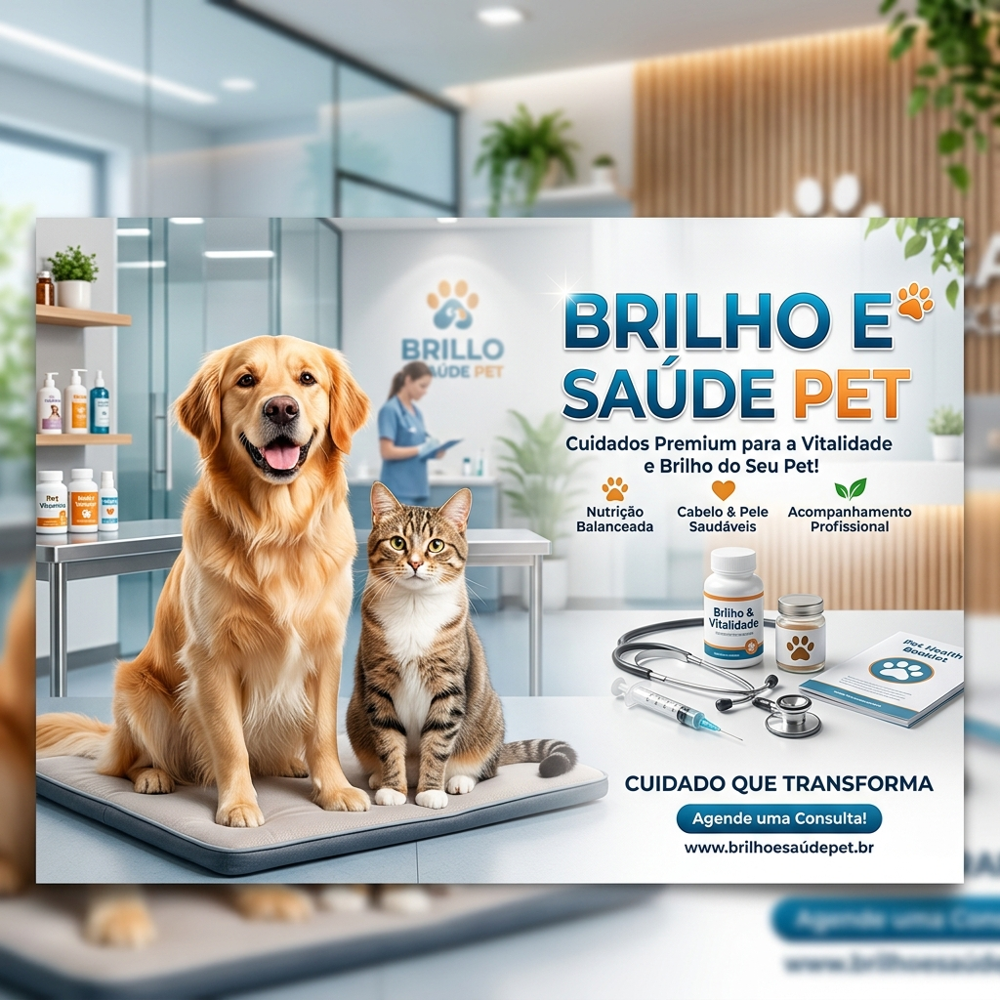

# 🧠 Caderno Temático com NotebookLM — Brilho e a Saúde do seu PET

<p align="center">

</p>

<p align="center">


</p>

---

# 📖 Sobre o projeto

Este projeto foi desenvolvido durante o desafio **"Treinando uma IA de Aprendizagem: Explore o Poder do NotebookLM"** da **Digital Innovation One (DIO)**.

O objetivo foi utilizar o **Google NotebookLM** como ferramenta de aprendizagem ativa para organizar conhecimentos, gerar resumos, criar um glossário de conceitos, elaborar perguntas de revisão e desenvolver uma coleção de prompts reutilizáveis a partir de fontes confiáveis sobre nutrição canina.

O tema escolhido foi **"Brilho e a Saúde do seu PET"**, reunindo materiais que abordam alimentação natural, nutrição bioativa, saúde intestinal, dermatites e cuidados com a pele e a pelagem dos cães.

---

# 🎯 Objetivos

- Demonstrar o uso do NotebookLM como ferramenta de estudo.
- Centralizar diferentes fontes em um único ambiente de aprendizagem.
- Criar um mini guia de estudo estruturado.
- Desenvolver uma coleção de prompts reutilizáveis.
- Organizar o conhecimento para futuras revisões.
- Incentivar o pensamento crítico durante o estudo.

---

# 🛠️ Ferramentas Utilizadas

| Ferramenta | Finalidade |
|------------|------------|
| Google NotebookLM | Organização e estudo das fontes |
| ChatGPT | Estruturação da documentação e do projeto |
| GitHub | Versionamento e documentação |
| Markdown | Organização dos arquivos |

---

# 📚 Fontes Utilizadas

As fontes utilizadas abordam alimentação natural, avaliação nutricional e saúde da pele dos cães.

- 📘 E-book **Brilho e a Saúde do seu PET**
- 📄 WSAVA Global Nutrition Toolkit
- 📄 AAHA Nutritional Assessment Guidelines
- 📄 Merck Veterinary Manual – Nutrition
- 📄 VCA Animal Hospitals – Nutrition Articles

---

# 📌 Contexto do Estudo

As fontes selecionadas apresentam a nutrição como um dos pilares para promoção da saúde e prevenção de doenças em cães.

Os materiais exploram conceitos como:

- Nutrição Bioativa;
- Avaliação Nutricional;
- Escore de Condição Corporal (ECC);
- Escore de Condição Muscular (ECM);
- Eixo Intestino-Pele;
- Microbioma Intestinal;
- Alimentação Natural;
- Protocolos de Transição Alimentar.

O NotebookLM foi utilizado para organizar essas informações e auxiliar na criação de materiais de apoio ao estudo.

---

# 🎓 Objetivos de Aprendizagem

Ao concluir este estudo, espera-se compreender:

- Como a alimentação influencia a saúde da pele e da pelagem;
- A importância da avaliação nutricional contínua;
- O conceito de Nutrição Bioativa;
- A relação entre intestino e sistema imunológico;
- Estratégias para transição alimentar;
- Cuidados necessários durante a alimentação natural.

---

# 🧠 Engenharia de Prompts

Durante o estudo foram desenvolvidos prompts reutilizáveis para diferentes objetivos.

## Resumos

- Resumos executivos
- Resumos por capítulo
- Resumos técnicos

## Revisão

- Revisão rápida
- Pontos principais
- Revisão para provas

## Quiz

- Questões abertas
- Verdadeiro ou falso
- Múltipla escolha

## Comparações

- Alimentação Natural x Ração
- ECC x ECM
- Dermatite x Inflamação

## Aplicação prática

- Estudos de caso
- Situações reais
- Planos de ação

Todos os prompts estão disponíveis em:

```text
/prompts/prompts.md
```

---

# 📂 Estrutura do Projeto

```text
📦 notebooklm-brilho-saude-pet
│
├── README.md
│
├── assets
│
├── fontes
│
├── prompts
│   └── prompts.md
│
├── mini-guia
│   ├── resumo.md
│   ├── glossario.md
│   └── revisao.md
│
└── LICENSE
```

---

# 📖 Mini Guia de Estudo

O mini guia foi organizado em três documentos:

### 📄 resumo.md

Resumo estruturado do conteúdo.

### 📄 glossario.md

Principais conceitos encontrados nas fontes.

### 📄 revisao.md

Material para revisão contendo:

- perguntas abertas;
- verdadeiro ou falso;
- múltipla escolha;
- gabaritos comentados.

---

# 💡 Principais Aprendizados

Durante o desenvolvimento deste projeto foi possível aprender:

- Curadoria de fontes;
- Organização do conhecimento;
- Engenharia de Prompts;
- Aprendizagem assistida por IA;
- Utilização prática do NotebookLM;
- Documentação técnica utilizando Markdown.

---

# 🚀 Como reproduzir este projeto

1. Criar um novo notebook no Google NotebookLM.
2. Adicionar as fontes de estudo.
3. Definir os objetivos de aprendizagem.
4. Utilizar os prompts disponíveis neste repositório.
5. Gerar resumos, glossário e materiais de revisão.
6. Organizar os resultados em Markdown.

---

# 👨‍💻 Autor

**Iago Figueiredo**

Projeto desenvolvido como parte do desafio da **Digital Innovation One (DIO)**.

---

⭐ Caso este projeto tenha sido útil para você, considere deixar uma estrela no repositório.